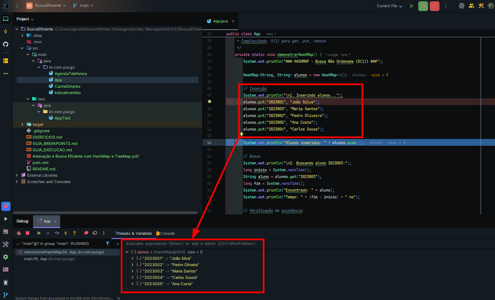
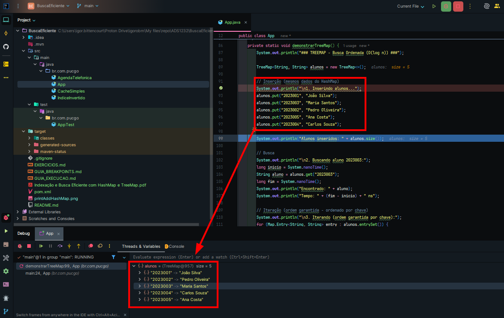

# Busca Eficiente com HashMap, TreeMap e LinkedHashMap (Java)

Projeto acadêmico em Java que demonstra, de forma prática, como indexar e buscar dados com eficiência usando as estruturas HashMap, TreeMap e LinkedHashMap. Inclui exemplos de uso, comparações de performance, um índice invertido simples e uma agenda telefônica ordenada.

## O que você encontra aqui
- Demonstração comparativa entre HashMap (O(1)) e TreeMap (O(log n))
- Índice invertido para busca de palavras em documentos (HashMap)
- Cache LRU simples com LinkedHashMap
- Agenda telefônica ordenada por nome usando TreeMap
- Benchmarks de inserção e busca com 10.000 elementos

## Estrutura
- `src/main/java/br/com/pucgo/App.java`: demo principal (HashMap vs TreeMap, índice de palavras, benchmark)
- `src/main/java/br/com/pucgo/IndiceInvertido.java`: índice invertido com HashMap
- `src/main/java/br/com/pucgo/CacheSimples.java`: cache LRU usando LinkedHashMap
- `src/main/java/br/com/pucgo/AgendaTelefonica.java`: agenda ordenada com TreeMap
- `src/test/java/br/com/pucgo/AppTest.java`: teste de fumo (JUnit 4)
- `Indexação e Busca Eficiente com HashMap e TreeMap.pdf`: material de apoio
- `printAddHashMap.png` e `printAddTreeMap.png`: imagens ilustrativas

## Pré-requisitos
- Java 8+ (JDK)
- Maven 3.6+

## Como executar
Rodar a demo principal (App):

```cmd
cd /d "C:\Users\igor.bittencourt\Proton Drive\igorobm\My files\repo\ADS1232\BuscaEficiente"
mvn -q clean compile
mvn -q exec:java
```

Executar uma classe específica (exemplos):

```cmd
mvn -q exec:java -Dexec.mainClass=br.com.pucgo.AgendaTelefonica
mvn -q exec:java -Dexec.mainClass=br.com.pucgo.IndiceInvertido
mvn -q exec:java -Dexec.mainClass=br.com.pucgo.CacheSimples
```

Rodar os testes:

```cmd
mvn -q test
```

Gerar JAR:

```cmd
mvn -q clean package
```

## Resumo da execução (saída exemplificativa)
Abaixo, um exemplo real de saída ao executar a demo principal:

```
=== DEMONSTRAÇÃO: HashMap vs TreeMap ===  ### HASHMAP - Busca Não Ordenada (O(1)) ###  1. Inserindo alunos... Alunos inseridos: 5  2. Buscando aluno 2023003: Encontrado: Maria Santos Tempo: 7600 ns  3. Verificando existência: Contém chave 2023001? true Contém valor 'Ana Costa'? true  4. Iterando (ordem não garantida):   Matrícula: 2023001 -> Nome: João Silva   Matrícula: 2023002 -> Nome: Pedro Oliveira   Matrícula: 2023003 -> Nome: Maria Santos   Matrícula: 2023004 -> Nome: Carlos Souza   Matrícula: 2023005 -> Nome: Ana Costa  5. Removendo aluno 2023003: Alunos restantes: 4  ==================================================  ### TREEMAP - Busca Ordenada (O(log n)) ###  1. Inserindo alunos... Alunos inseridos: 5  2. Buscando aluno 2023003: Encontrado: Maria Santos Tempo: 41700 ns  3. Iterando (ordem garantida por chave):   Matrícula: 2023001 -> Nome: João Silva   Matrícula: 2023002 -> Nome: Pedro Oliveira   Matrícula: 2023003 -> Nome: Maria Santos   Matrícula: 2023004 -> Nome: Carlos Souza   Matrícula: 2023005 -> Nome: Ana Costa  4. Operações especiais do TreeMap:   Primeira chave: 2023001   Última chave: 2023005   Menor chave >= 2023003: 2023003   Maior chave <= 2023003: 2023003  5. Sub-mapa (2023002 a 2023004):   Matrícula: 2023002 -> Nome: Pedro Oliveira   Matrícula: 2023003 -> Nome: Maria Santos   Matrícula: 2023004 -> Nome: Carlos Souza  ==================================================  ### COMPARAÇÃO DE PERFORMANCE ###  Testes com 10000 elementos:  HashMap:   Tempo de inserção: 6.3455 ms   Tempo de busca: 1.4319 ms  TreeMap:   Tempo de inserção: 17.9591 ms   Tempo de busca: 4.5914 ms  Análise:   HashMap é 2,83x mais rápido na inserção   HashMap é 3,21x mais rápido na busca  ==================================================  ### CASO PRÁTICO: Índice de Palavras ###  1. Contando frequência com HashMap: Palavras encontradas (ordem não garantida):   de: 1 vez(es)   a: 1 vez(es)   utilizada: 1 vez(es)   java: 3 vez(es)   linguagem: 1 vez(es)   programação: 2 vez(es)   orientada: 1 vez(es)   uma: 1 vez(es)   em: 1 vez(es)   é: 3 vez(es)   muito: 1 vez(es)   objetos: 1 vez(es)  2. Usando TreeMap para ordem alfabética:   a: 1 vez(es)   de: 1 vez(es)   em: 1 vez(es)   java: 3 vez(es)   linguagem: 1 vez(es)   muito: 1 vez(es)   objetos: 1 vez(es)   orientada: 1 vez(es)   programação: 2 vez(es)   uma: 1 vez(es)   utilizada: 1 vez(es)   é: 3 vez(es)  3. TreeMap com comparador customizado (por frequência): Palavras mais frequentes:   java: 3 vez(es)   é: 3 vez(es)   programação: 2 vez(es)   a: 1 vez(es)   de: 1 vez(es)  ### RESUMO ### - Use HashMap quando: precisa de máxima performance e não precisa de ordem - Use TreeMap quando: precisa manter elementos ordenados ou fazer buscas por intervalo
```

Observação: tempos variam conforme hardware e ambiente de execução. A conclusão principal permanece — HashMap tende a ser mais rápido que TreeMap para operações diretas de inserção e busca, enquanto TreeMap oferece ordenação natural e operações por intervalo.

## Capturas de tela





## Dicas e notas
- HashMap: melhor escolha quando performance é prioridade e a ordem não importa.
- TreeMap: mantém os elementos ordenados por chave e permite operações por intervalo (subMap, ceiling/floor, first/last).
- LinkedHashMap: útil para cenários de cache (ordem de acesso) e políticas como LRU.

## Material de apoio
- Consulte o PDF "Indexação e Busca Eficiente com HashMap e TreeMap.pdf" na raiz do projeto para um material resumido com os conceitos.

---
Se quiser contribuir, sinta-se à vontade para abrir issues ou PRs. 🙂

